# GTAF — Generalized Typed Atom Framework

GTAF is a **universal data model and storage framework** designed to represent heterogeneous domains without upfront schema design, while remaining viable for real-world workloads such as OLTP, IoT, and AI systems.

GTAF separates **identity from value**, preserves **logical history**, supports **selective deduplication**, and integrates **graph and vector semantics** — without falling into the common traps of naïve immutable or content-addressed systems.

📄 See [docs/](docs/) for architecture, design documents, and specifications.

---

## Core Principles

GTAF is built on five principles:

1. **Identity is separate from value**
2. **Values are strongly typed**
3. **History is preserved logically**
4. **Immutability is a semantic contract, not a physical rule**
5. **Physical storage must optimize for locality and write efficiency**

---

## Core Concepts

```mermaid
flowchart TD
    subgraph Storage["Storage Layer"]
        AS[AtomStore]
        RI[Reference Index]
        CI[Content Index]
    end

    subgraph Data["Data Model"]
        A1[Atom]
        A2[Atom]
        A3[Atom]
        EID[EntityId]
    end

    subgraph Projection["Projection Layer"]
        PE[ProjectionEngine]
        N[Node]
    end

    A1 -->|references| EID
    A2 -->|references| EID
    A3 -->|references| EID

    AS -->|stores| A1
    AS -->|stores| A2
    AS -->|stores| A3

    RI -->|maps entity → atoms| EID
    CI -->|deduplicates| A1

    PE -->|rebuilds from atoms| N
    EID -.->|projects to| N
```



### EntityId

An **EntityId** is a stable 16-byte identifier for a logical entity (e.g. Customer, Recipe, Sensor).

EntityIds:

- Are immutable and globally unique
- Represent pure identity (no behavior or state)
- Are referenced by atoms via the Reference Index

### Node

A **Node** is an ephemeral projection of an entity's current state, rebuilt on-demand from the atom log.

Nodes:

- Are derived views, not stored directly
- Aggregate atoms by type tag (latest value per tag)
- Maintain history references for temporal queries
- Are rebuilt by the ProjectionEngine

---

### Atom (Typed Value)

An **Atom** is a typed unit of value.  
Atoms are classified into **three categories**, each optimized for different workloads:

#### 1. Canonical Atoms

Used for business facts and metadata:

- Names
- Status
- Configuration
- Documents

Properties:

- Immutable
- Content-addressed
- Globally deduplicated

#### 2. Temporal Atoms

Used for high-frequency data:

- IoT readings
- Logs
- Metrics
- Time-series

Properties:

- Append-only
- Chunked for sequential I/O
- Not deduplicated per value
- Immutable at chunk level

#### 3. Mutable Atoms

Used for:

- Counters
- Aggregates
- Derived state

Properties:

- Controlled mutation
- Delta-logged
- Periodically snapshotted

> Logical history is preserved for all atom classes, even when physical mutation is used.

---

### Property

A **Property** is a named pointer from a Node to an Atom.

Node ── property ──▶ Atom

---

### Edge

An **Edge** is a relationship between entities, stored as a Canonical atom containing an EdgeValue.

```cpp
struct EdgeValue {
    EntityId target;
    std::string relation;
};
```

Edges:

- Are atoms (benefit from deduplication and history)
- Link a source entity to a target entity with a named relation
- Support bidirectional queries via the Reference Index

---

## Architecture Overview

### Logical Model

- Nodes
- Atom classes
- Edges
- Version semantics

### Physical Model

- Projection layers (row, column, graph neighborhood)
- Storage engines optimized for locality
- Append-only logs and compaction
- Asynchronous index maintenance

> Logical immutability does not imply physical immutability.

---

## Query Model

GTAF supports querying through the QueryIndex and ProjectionEngine:

**Implemented:**

- Tag-based filtering (find atoms by type tag)
- Entity lookups (get all atoms for an entity)
- Node projection (rebuild current state from atom log)
- History queries (access previous values via LSN ordering)

**Planned:**

- Graph traversal queries
- Vector similarity search
- Hybrid query engine combining structured and semantic search

---

## Vector Search (Planned)

Vector embeddings can be stored as atom values, but similarity search is not yet implemented.

**Design goals:**

- Decouple embeddings from atom immutability
- Support stable vector handles with versioning
- Asynchronous index compaction
- Avoid index churn from high write rates

See [docs/design/](docs/design/) for current design discussions.

---

## What GTAF Is (and Is Not)

**GTAF is:**

- A universal typed data substrate
- Schema-optional but type-safe
- History-preserving
- AI-ready by design

**GTAF is not:**

- A naïve immutable store
- A pure content-addressed filesystem
- A replacement for all physical databases
- A vector database pretending to be transactional

---

## Example Use Cases

- **CRM / ERP**  
  Canonical atoms for identity, temporal atoms for activity, mutable atoms for aggregates

- **AI / RAG Systems**  
  Structured truth + semantic embeddings in one model

- **Content Platforms**  
  Canonical atoms + graph relationships

- **IoT / Telemetry**  
  Chunked temporal atoms + analytical projections

---

## Project Status

🚧 **Active development — core implementation complete**

### What's Working

- ✅ Atom storage with three classifications (Canonical, Temporal, Mutable)
- ✅ Content-addressed deduplication for Canonical atoms
- ✅ Append-only persistence with WAL
- ✅ Node projection from atom log
- ✅ Entity-Atom reference indexing
- ✅ Query index with tag-based filtering
- ✅ Temporal chunking for time-series data
- ✅ Delta-logged mutable state with snapshots
- ✅ Edge storage as Canonical atoms

### In Progress

- 🔄 Multi-reader concurrency (currently single-threaded)
- 🔄 Compaction and cleanup strategies

### Planned

- 📋 Vector similarity search (embeddings can be stored, search not implemented)
- 📋 Graph traversal queries
- 📋 Hybrid query engine
- 📋 Storage engine optimizations

---

## License

Apache 2.0 (proposed)

---

## Documentation

- [Architecture](docs/architecture/) — System structure and pipelines
- [Design](docs/design/) — Internal design and implementation details
- [Specifications](docs/specs/) — Contracts and expected behavior
- [ADRs](docs/adr/) — Architecture Decision Records

Key documents:

- [Atom-Node Design](docs/design/atom-node-design.md) — Core data model relationships
- [Write-Read Pipelines](docs/architecture/write-read-pipelines.md) — Data flow architecture
- [Entity Deduplication](docs/architecture/entity-deduplication.md) — Content-addressed storage
