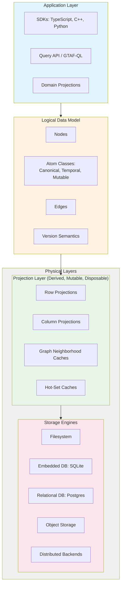

# GTAF — Generalized Typed Atom Framework

Revised Whitepaper (Production-Viable Edition)
Version 1.1 — Corrected Architecture
Abstract

GTAF (Generalized Typed Atom Framework) is a universal data model and storage framework designed to represent heterogeneous domains without upfront schema design. GTAF separates identity from value, enforces strong typing, preserves logical immutability and history, supports selective global deduplication, and natively integrates vector semantics.

This revision corrects critical scalability bottlenecks found in naïve immutable and content-addressed systems by introducing tiered atom classes, physical projection layers, and decoupled vector lifecycle management. GTAF now explicitly distinguishes between logical truth guarantees and physical storage realities, making it viable for OLTP, IoT, and AI-heavy workloads.

1. Executive Summary

Modern software systems repeatedly rebuild data models for each domain (CRM, ERP, IoT, CMS, knowledge graphs). This leads to schema churn, migrations, duplicated data, fragmented query engines, and poor long-term evolvability.

GTAF proposes a universal data substrate based on four principles:

Identity is separate from value

Values are strongly typed

History is preserved logically

Storage is backend-agnostic

This revised specification acknowledges that immutability is a logical contract, not a physical storage mandate. GTAF therefore combines immutable semantics with locality-optimized, write-efficient storage strategies.

2. Problem Statement

2.1 Schema Rigidity

Relational and document databases require early schema commitment and continuous migrations.

2.2 Data Fragmentation

The same facts are duplicated across systems with no shared semantic identity.

2.3 Auditability & Provenance

Most systems overwrite values, losing historical truth.

2.4 Heterogeneous Query Needs

Applications increasingly require:

Structured filtering

Relationship traversal

Full-text search

Vector similarity

Stacking multiple engines increases complexity and cost.

1. Core Conceptual Model

3.1 Node (Identity)

A Node represents an identity-bearing entity:

Customer

Recipe

Sensor

Order

Nodes do not store values directly.

3.2 Atom (Typed Value)

An Atom is a strongly typed unit of value.
Atoms are classified into three categories, each with different guarantees.

3.2.1 Canonical Atoms (Immutable, Deduplicated)

Used for:

Names

Status

Configuration

Metadata

Business facts

Properties:

Immutable

Content-addressed (hash(type + value))

Globally deduplicated

Suitable for semantic reuse

3.2.2 Temporal Atoms (Append-Chunked)

Used for:

Time-series

IoT readings

Logs

Metrics

Properties:

Append-only

Chunked for sequential I/O

Not deduplicated per value

Immutable at chunk level

3.2.3 Mutable Atoms (Controlled Mutation)

Used for:

Counters

Aggregates

Derived state

Properties:

Mutable within bounded scope

Logged as deltas

Periodically snapshotted

Key principle:
All atom classes preserve logical history, but not all require physical immutability.

3.3 Property

A Property is a named pointer from a Node to an Atom (of any class).

3.4 Edge

An Edge is an explicit relationship between Nodes, enabling graph traversal and domain modeling.

1. Architecture Overview

5. Storage Model

5.1 Logical Tables

NODE(node_id, created_at)

ATOM(atom_id, class, type, value, created_at)

EDGE(from_node, to_node, relation)

LOG(event_type, timestamp, payload)

5.2 Physical Layout

Storage layout is backend-specific and optimized for locality:

Sequential writes for temporal data

Packed segments for canonical atoms

Compacted projections for queries

1. Deduplication & History Semantics
6.1 Selective Deduplication

Only Canonical Atoms participate in global deduplication.

This avoids write amplification for:

IoT

Counters

Logs

6.2 Logical History

Every update:

Creates a new logical version

Preserves previous references

Enables time-travel queries

7. Query Model

GTAF supports hybrid queries over projections:

Structured filters

Relationship traversal

Aggregations

Vector similarity

Example:

FIND Customer WHERE status = "active"
TRAVERSE Order FROM Customer:123
VECTOR_SIMILAR("industrial equipment buyer") TOP 10

Queries operate on materialized projections, not raw atom pointers.

8. Vector Embedding Layer
8.1 Decoupled Vector Lifecycle

Vectors are not directly bound to atom immutability.

Instead:

Atoms reference a Vector Handle

Vectors may be updated, versioned, or tombstoned

Index compaction happens asynchronously

8.2 Stability Guarantees

High write rates do not cause index churn

HNSW graphs remain stable

Rebuilds are offline and atomic

This aligns GTAF with production vector systems.

9. Developer Mental Model

Developers do not design schemas.

They:

Create Nodes

Attach typed Atoms

Create Edges

Query projections

Cheat sheet:

Node = identity
Atom = typed value (classed)
Property = Node → Atom
Edge = Node → Node
History = automatic

10. Example Domains
10.1 CRM

Canonical atoms for identity and status

Temporal atoms for activity logs

Mutable atoms for counters (LTV)

10.2 Recipe Platform

Canonical atoms for titles, ingredients

Edges for steps and relationships

10.3 IoT

Temporal atoms for sensor streams

Chunked sequential writes

Projections for analytics

11. Scalability
Horizontal

Hash-based partitioning

Independent scaling of projections and vectors

Content-addressed replication

Vertical

Embedded → SQL → Distributed

No application rewrite required

12. Business Value

Eliminates schema migration cost

Enables cross-application reuse

Preserves auditability

Supports AI workloads natively

Avoids write amplification traps

13. Competitive Landscape
System	Limitation
Graph DB	Mutable values, no history
JSON DB	Weak typing
EAV	Value explosion
Datomic	Poor time-series support
Vector DBs	No transactional context

GTAF integrates these concerns into one coherent model.

14. Roadmap

Alpha: Canonical + Temporal atoms, FS backend

Beta: SQL backend, projection engine, vector layer

GA: Distributed replication, CRDT extensions

15. Conclusion

GTAF is not an immutable-at-all-costs system.
It is a truth-preserving system.

By separating logical guarantees from physical optimization, GTAF becomes suitable for real-world workloads without abandoning its core principles.

Final Note

Immutability is a contract of meaning, not a constraint on bytes.
