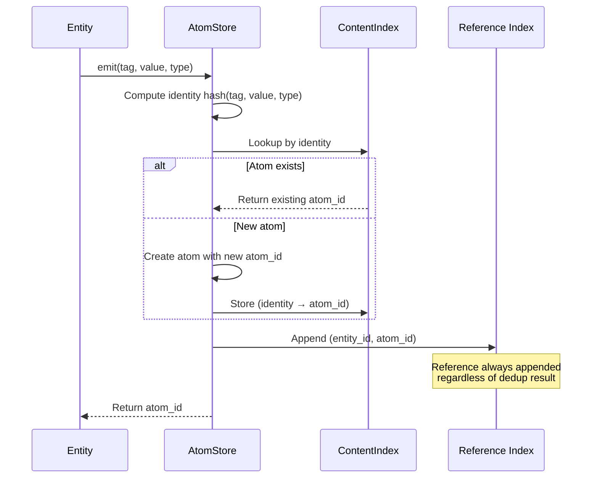
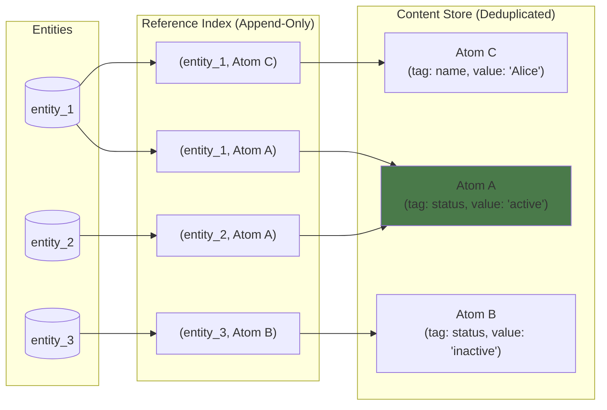

# Entity Deduplication Architecture

**Status:** Stable  
**Last updated:** 2026-01-18  
**Owner:** GTAF Core  
**Related ADRs:** ADR-001, ADR-004  

---

## 1. Purpose

This document describes the architecture used by GTAF to deduplicate entities
while preserving append-only persistence, immutability, and historical auditability.

The goal is to ensure that identical logical values are stored once, while allowing
multiple entities to reference them without loss of association or correctness.

---

## 2. Scope

### In Scope

- Deduplication of atom values across entities
- Relationship between entities, atoms, and reference indexes
- Structural guarantees required to preserve correctness

### Out of Scope

- Rationale for choosing deduplication strategies (see ADRs)
- Performance optimizations and indexing internals
- Query execution details

---

## 3. Context

GTAF models information using:

- **Entities** as logical aggregations
- **Atoms** as immutable, typed values
- **Append-only persistence** as a hard invariant

Multiple entities may produce atoms with identical semantic value
(e.g. same tag + value). To avoid duplication while preserving correctness,
the system must:

- Reuse identical atoms
- Preserve all entity-to-atom relationships
- Avoid hidden or implicit coupling

---

## 4. Detailed Description

### 4.1 Atom Identity

Atoms are uniquely identified by their semantic content:

```text
(tag, normalized_value, type)
```

If an atom with identical identity already exists, it is reused.
Atoms themselves are immutable and unaware of which entities reference them.

---

### 4.2 Entity–Atom Relationship

Entities do **not** own atoms.

Instead:

- Entities reference atoms
- References are explicit
- References are append-only

This prevents accidental loss of relationships when deduplication occurs.

---

### 4.3 Reference Index

A dedicated **Entity–Atom Reference Index** is maintained as a first-class structure.

Properties:

- Append-only
- Explicit entity → atom associations
- No back-references inside atoms

Each new association appends a new record:

```text
(entity_id, atom_id)
```

Multiple entities may reference the same atom.
An entity may reference multiple atoms.

---

### 4.4 Deduplication Flow

1. An entity emits a candidate atom
2. The atom identity is computed
3. If the atom already exists:
   - The existing atom_id is reused
4. A new entity–atom reference is appended
5. No existing data is mutated

This ensures that deduplication never removes information.

#### Deduplication Flow Diagram



#### Multiple Entities Sharing Atoms



> In this example, entity_1 and entity_2 both reference Atom A (status: 'active'). The atom is stored once, but both entity relationships are preserved in the Reference Index.

---

### 4.5 Snapshot and Read Semantics

Because both atoms and references are append-only:

- Historical snapshots remain consistent
- Readers observe a stable view
- Deduplication does not affect past reads

Snapshots are defined over:

- Atom store state
- Reference index state

---

## 5. Constraints & Invariants

The following invariants must always hold:

- Atoms are immutable
- Persistence is append-only
- Deduplication must not remove associations
- Entity–atom relationships are explicit
- No atom contains entity-specific state
- No in-place mutation of references is allowed

Violating any of these breaks historical correctness.

---

## 6. Trade-offs & Limitations

### Trade-offs

- Additional storage for reference indexes
- Slightly more complex read paths
- Indirection between entities and atoms

### Limitations

- Reference growth is unbounded by design
- Cleanup or compaction must be modeled explicitly
- Deduplication granularity is limited to atom identity rules

These trade-offs are accepted to preserve auditability and correctness.

---

## 7. References

- [ADR-001: Append-Only Atom Log](../adr/001-append-only-atom-log.md)
- [ADR-004: Entity-Atom Reference Index](../adr/004-entity-atom-reference-index.md)
- [Design: Atom-Node Relationship](../design/atom-node-design.md)
- [Design: Atom Taxonomy](../design/atom-taxonomy.md)
- [Design: Constraints Plan](../design/constraints-plan.md)
