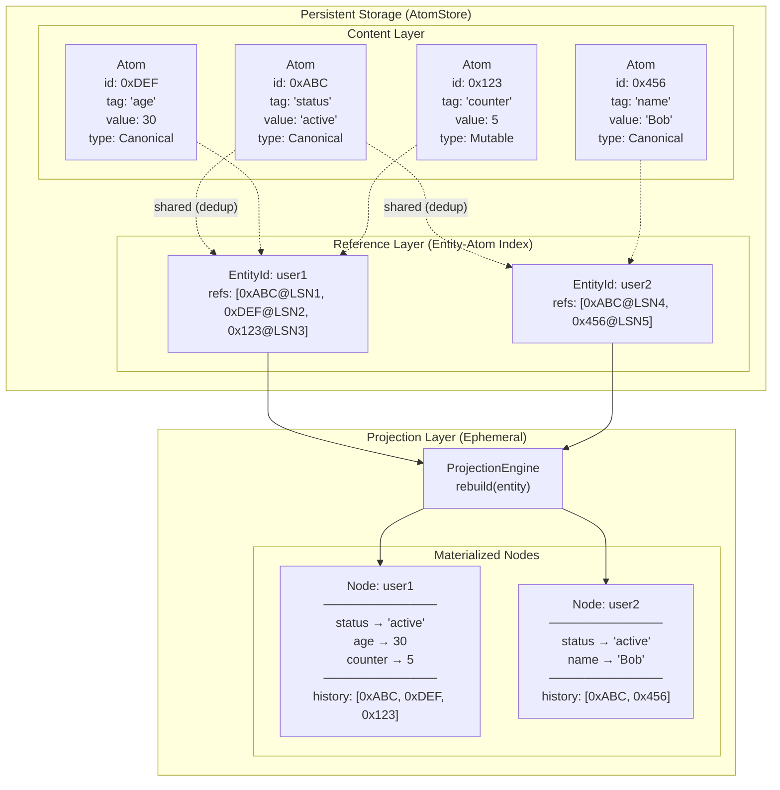
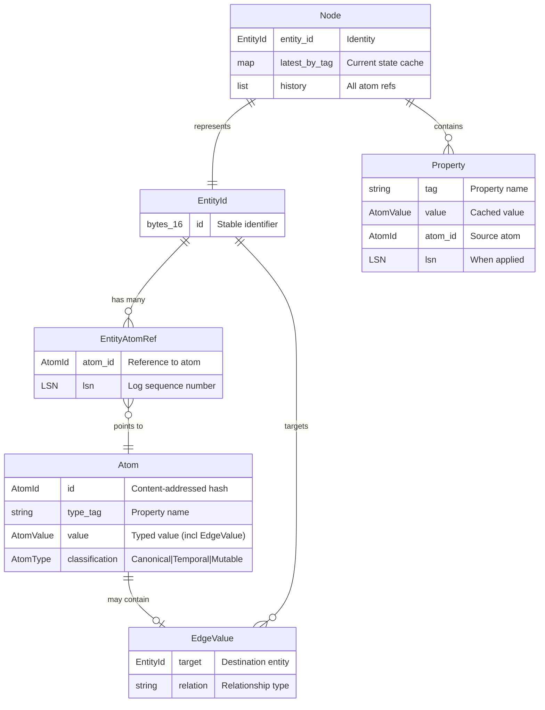
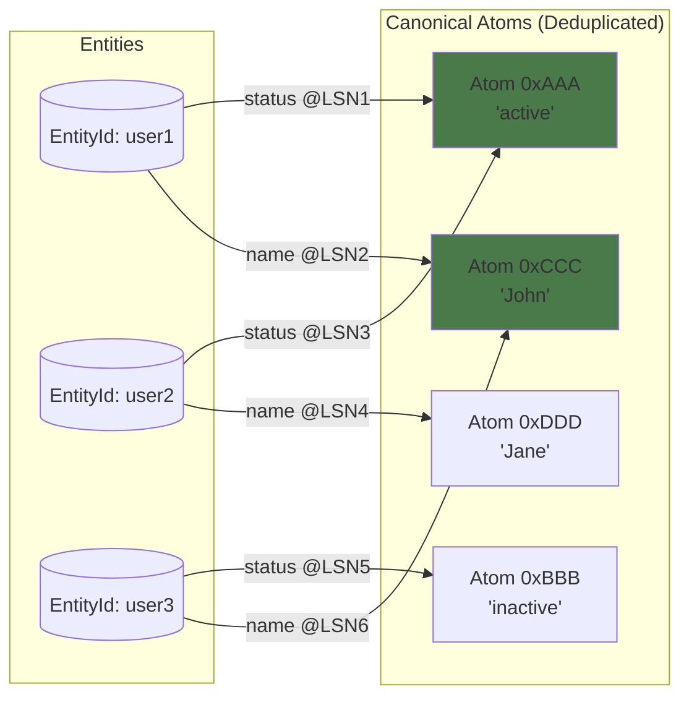
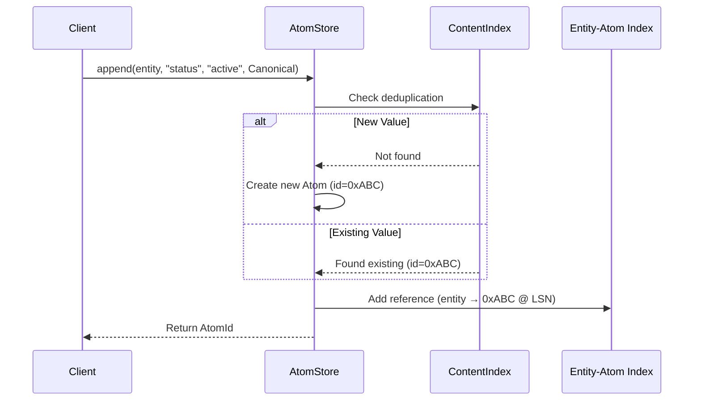
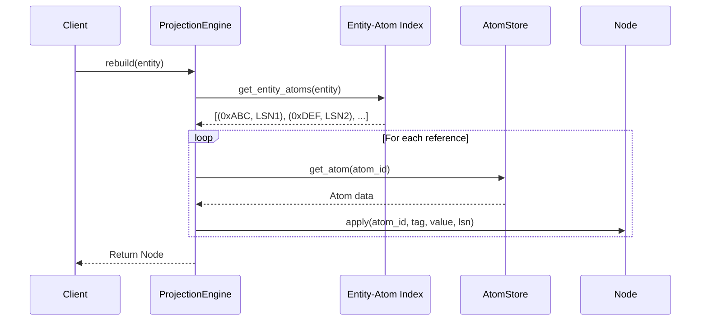
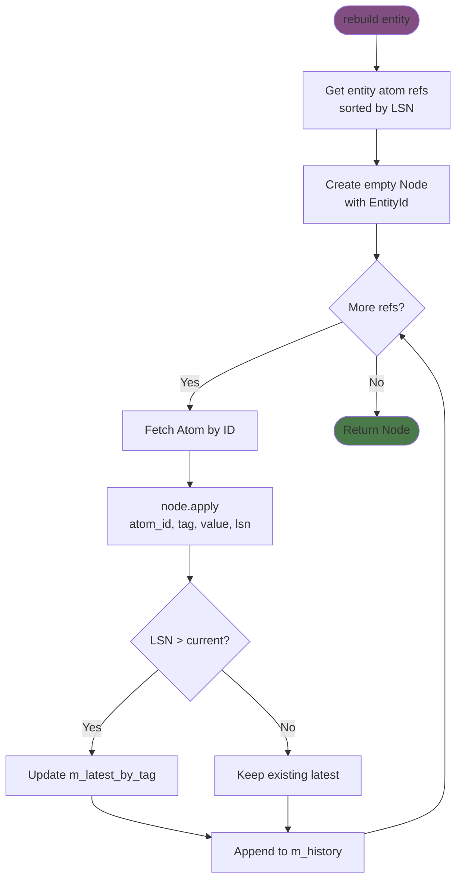
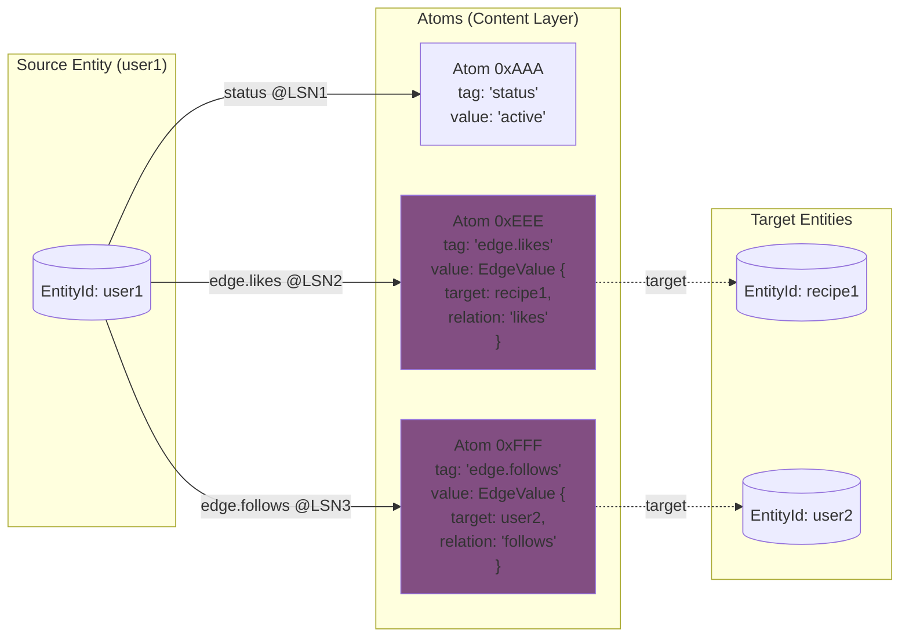
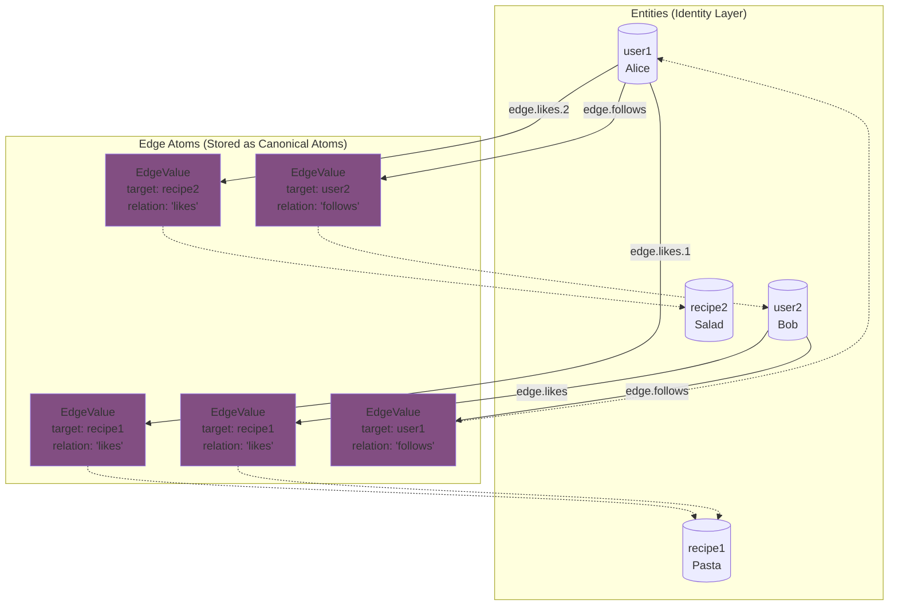
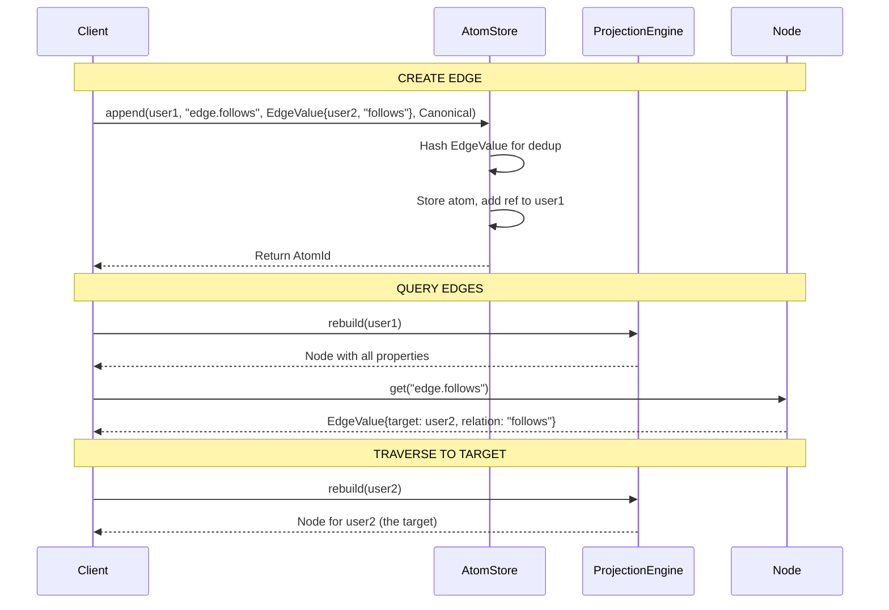

# Atom-Node Relationship Design

**Status:** Stable  
**Last updated:** 2026-01-18  
**Owner:** GTAF Core  
**Related ADRs:** ADR-001, ADR-002, ADR-003, ADR-004  

---

## Overview

This document describes the design of the relationship between Atoms and Nodes in GTAF, explaining the rationale behind key decisions, trade-offs considered, and invariants that must be maintained.

**Related Documents:**

- [ADR-001: Append-Only Atom Log](../adr/001-append-only-atom-log.md)
- [ADR-002: Single-Writer Multi-Reader](../adr/002-single-writer-multi-reader.md)
- [ADR-003: Atom Taxonomy](../adr/003-atom-taxonomy.md)
- [ADR-004: Entity-Atom Reference Index](../adr/004-entity-atom-reference-index.md)
- [Architecture: Write-Read Pipelines](../architecture/write-read-pipelines.md)
- [Architecture: Entity Deduplication](../architecture/entity-deduplication.md)

---

## 1. High-Level Architecture



The architecture consists of three layers:

1. **Content Layer**: Stores deduplicated atoms (immutable values)
2. **Reference Layer**: Maps entities to their atoms via LSN-ordered references
3. **Projection Layer**: Rebuilds ephemeral nodes on-demand from the atom log

---

## 2. Core Concepts

### 2.1 Atom

An **Atom** is the fundamental unit of storage in GTAF. It represents a single, typed, immutable value.

```cpp
// From src/core/atom.h
class Atom {
    AtomId m_atom_id;           // Content-addressed identifier
    std::string m_type_tag;     // Property name (e.g., "status", "age")
    AtomValue m_value;          // The actual value
    AtomType m_atom_type;       // Classification: Canonical|Temporal|Mutable
};
```

**Key Properties:**

- **Content-addressed**: AtomId is derived from value content (enables deduplication)
- **Immutable**: Once created, an atom's value never changes
- **Typed**: Values are strongly typed via `std::variant`
- **Classified**: Atoms have semantic classification affecting storage behavior

### 2.2 EntityId

An **EntityId** is a stable 16-byte identifier for a logical entity.

```cpp
// From src/types/types.h
struct EntityId {
    std::array<uint8_t, 16> bytes;
};
```

**Key Properties:**

- **Pure identity**: Has no behavior, is not an object, is not mutable
- **Stable**: Never changes for the lifetime of an entity
- **Lightweight**: Just 16 bytes, cheap to copy and store

### 2.3 Node

A **Node** is an ephemeral projection of an entity's current state, rebuilt on-demand from the atom log.

```cpp
// From src/core/node.h
class Node {
    EntityId m_entity_id;
    std::unordered_map<std::string, std::optional<Entry>> m_latest_by_tag;
    std::vector<std::pair<AtomId, LogSequenceNumber>> m_history;
};
```

**Key Properties:**

- **Derived**: Not stored, computed from atoms
- **Ephemeral**: Exists only in memory during use
- **Fast reads**: O(1) property access via cached values
- **Full history**: Maintains complete audit trail

### 2.4 Edge

An **Edge** is a relationship between entities, stored as an Atom containing an `EdgeValue`.

```cpp
// From src/types/types.h
struct EdgeValue {
    EntityId target;
    std::string relation;
};
```

**Key Properties:**

- **Unified storage**: Edges are atoms, not a separate concept
- **Unidirectional**: Source entity references target entity
- **Deduplicated**: Same edge content shared across entities

### 2.5 Entity-Relationship Model



---

## 3. Design Rationale

### 3.1 Why Separate Identity (EntityId) from State (Node)?

**Decision:** EntityId is a pure identifier; Node is a derived view.

**Rationale:**

1. **Different lifecycles**
   - EntityId: Permanent, can be stored in atoms, edges, external systems
   - Node: Temporary, rebuilt when needed, garbage collected after use

2. **Memory efficiency**
   - With millions of entities, storing EntityIds costs 16 bytes each
   - Nodes can be large (many properties, full history)
   - Only materialize nodes when actually needed

3. **Multiple views of same entity**
   - Can rebuild node at different points in time (time-travel queries)
   - Can have partial projections (only specific properties)
   - Same EntityId, different Node instances

4. **Reference without materialization**
   - Edges store EntityId, not Node
   - Can reference an entity without loading its full state

**Alternatives Considered:**

| Alternative | Why Rejected |
| ----------- | ------------ |
| Merge Node and EntityId | Would require keeping all nodes in memory or losing stable references |
| Node as persistent object | Would duplicate data already in atom log, consistency issues |
| EntityId contains Node pointer | Circular dependency, lifetime management complexity |

### 3.2 Why Content-Addressed Atoms?

**Decision:** AtomId is derived from atom content (hash of type_tag + value).

**Rationale:**

1. **Automatic deduplication**
   - Same value stored once, referenced many times
   - Significant space savings for common values ("active", "pending", etc.)

2. **Integrity verification**
   - AtomId proves content hasn't changed
   - Enables trust in replicated data

3. **Efficient equality checks**
   - Comparing AtomIds is O(1) instead of O(n) value comparison

**Trade-offs:**

| Benefit | Cost |
| ------- | ---- |
| Space efficiency via dedup | Hash computation on every write |
| Content integrity | Must maintain content index |
| Fast equality | AtomId doesn't encode type information |

#### Deduplication Visualization



> Note: user1 and user2 share the same "active" atom (0xAAA). user1 and user3 share the same "John" atom (0xCCC). This is the deduplication benefit of Canonical atoms.

### 3.3 Why Append-Only Storage?

**Decision:** Atoms are never modified or deleted, only appended.

**Rationale:**

1. **Complete history preservation**
   - Every change is recorded
   - Enables audit, replay, time-travel

2. **Simplified concurrency**
   - Writers only append, never modify existing data
   - Readers see consistent snapshots

3. **Crash safety**
   - Partial writes don't corrupt existing data
   - Recovery is straightforward

4. **Replication simplicity**
   - Replicas just replay the log
   - No conflict resolution for modifications

**Trade-offs:**

| Benefit | Cost |
| ------- | ---- |
| Full history | Storage grows indefinitely (needs compaction) |
| Simple concurrency | "Delete" requires tombstones or log rewrite |
| Crash safety | More I/O than in-place updates |

### 3.4 Why Edges as Atoms?

**Decision:** Edges are stored as atoms with `EdgeValue` type, not as a separate storage mechanism.

**Rationale:**

1. **Unified model**
   - One storage mechanism for all data
   - Edges get deduplication, history, projection for free

2. **Consistent semantics**
   - Edge history tracked same as property history
   - Same LSN-based ordering applies

3. **Simpler implementation**
   - No separate edge storage, edge index, edge persistence
   - Reuse all atom infrastructure

**Trade-offs:**

| Benefit | Cost |
| ------- | ---- |
| Code simplicity | Edge traversal requires property lookup + rebuild |
| Unified history | No optimized reverse-edge index (yet) |
| Deduplication | Tag naming conventions needed (edge.X) |

### 3.5 Why Rebuild Nodes On-Demand?

**Decision:** Nodes are not persisted; they are rebuilt from atoms when needed.

**Rationale:**

1. **Single source of truth**
   - Atom log is authoritative
   - No risk of node state diverging from atoms

2. **Storage efficiency**
   - Don't store derived data
   - Atoms already contain all information

3. **Flexibility**
   - Can rebuild with different projection strategies
   - Can rebuild partial views (only needed properties)

4. **Consistency**
   - Fresh rebuild always reflects latest atoms
   - No cache invalidation complexity

**Trade-offs:**

| Benefit | Cost |
| ------- | ---- |
| Consistency guaranteed | Rebuild cost on every read |
| No derived data storage | Latency for first access |
| Flexible projections | No persistent materialized views (yet) |

**Mitigation:** Add optional node caching layer for frequently accessed entities.

---

## 4. Data Flow

### 4.1 Write Path



**Steps:**

1. Hash the (type_tag, value) to get content address
2. Check ContentIndex for existing atom (deduplication)
3. If new, create atom and add to ContentIndex
4. Always add EntityAtomRef to RefIndex (entity → atom @ LSN)
5. Return AtomId to caller

### 4.2 Read Path



**Steps:**

1. Fetch all atom references for entity (sorted by LSN)
2. For each reference, fetch the atom
3. Apply atom to node (update latest_by_tag if newer, always append to history)
4. Return fully constructed node

### 4.3 Node Rebuild Process



---

## 5. Edges: Graph Relationships

Edges in GTAF are **not a separate storage concept** - they are simply **Atoms containing an `EdgeValue`**. This design means edges benefit from the same deduplication, history, and projection mechanisms as all other data.

### 5.1 Edge Storage Model



### 5.2 Complete Graph Example



> Note: E2 (user1 likes recipe1) and E4 (user2 likes recipe1) could be **deduplicated** if they have identical EdgeValue content (same target + relation). This is the power of content-addressed storage.

### 5.3 Edge Creation and Traversal



### 5.4 Edge Properties Summary

| Property | Description |
| -------- | ----------- |
| **Storage** | Edges are Atoms with `AtomValue` type `EdgeValue` |
| **Classification** | Typically Canonical (immutable, deduplicated) |
| **Direction** | Unidirectional: source entity → target entity |
| **Tag Convention** | Usually prefixed with `edge.` (e.g., `edge.follows`, `edge.likes`) |
| **Deduplication** | Same edge content shared across entities |
| **History** | Full edge history preserved in node's `m_history` |
| **Traversal** | Manual via `node.get("edge.X")` → rebuild target (Graph API planned for Beta) |

---

## 6. Invariants

These properties must always hold true:

### 6.1 Identity Invariants

| Invariant | Description |
| --------- | ----------- |
| **I1** | EntityId is immutable once created |
| **I2** | EntityId is unique across the system |
| **I3** | EntityId can exist without any atoms (empty entity) |

### 6.2 Atom Invariants

| Invariant | Description |
| --------- | ----------- |
| **A1** | AtomId is deterministic: same (type_tag, value) → same AtomId |
| **A2** | Atom content never changes after creation |
| **A3** | Atoms are never deleted (append-only) |
| **A4** | Every atom has exactly one classification (Canonical/Temporal/Mutable) |

### 6.3 Reference Invariants

| Invariant | Description |
| --------- | ----------- |
| **R1** | EntityAtomRef always points to a valid atom |
| **R2** | LSN is monotonically increasing per entity |
| **R3** | Multiple entities can reference the same atom (deduplication) |
| **R4** | One entity can have multiple refs to same atom (different LSNs) |

### 6.4 Node Invariants

| Invariant | Description |
| --------- | ----------- |
| **N1** | Node.entity_id never changes after construction |
| **N2** | Node.latest_by_tag reflects highest-LSN atom per tag |
| **N3** | Node.history contains all atoms ever applied (in LSN order) |
| **N4** | Rebuilding same entity at same LSN produces identical node |

### 6.5 Edge Invariants

| Invariant | Description |
| --------- | ----------- |
| **E1** | EdgeValue.target is a valid EntityId (may reference non-existent entity) |
| **E2** | Edges are unidirectional (source → target) |
| **E3** | Reverse traversal requires separate index or full scan |

---

## 7. Design Constraints

### 7.1 Memory Constraints

- **Node size**: Proportional to number of unique tags + history length
- **AtomStore**: Grows indefinitely without compaction
- **ContentIndex**: One entry per unique (type_tag, value) combination
- **RefIndex**: One entry per (entity, atom, lsn) tuple

### 7.2 Performance Constraints

| Operation | Complexity | Notes |
| --------- | ---------- | ----- |
| Append atom | O(1) amortized | Hash + index insert |
| Rebuild node | O(n) | n = number of atoms for entity |
| Node.get(tag) | O(1) | Hash table lookup |
| Node.history() | O(1) | Returns reference |
| Find by value | O(n) or O(1) | Full scan or QueryIndex |

### 7.3 Consistency Constraints

- **Single-writer**: Only one writer at a time (see ADR-002)
- **Snapshot isolation**: Readers see consistent point-in-time view
- **Eventual consistency**: After write completes, all subsequent reads see it

---

## 8. Key Relationships Summary

| From | To | Relationship | Cardinality | Notes |
| ---- | -- | ------------ | ----------- | ----- |
| EntityId | Atom | References via EntityAtomRef | 1:N | One entity can have many atoms |
| Atom | EntityId | Referenced by | N:M | Canonical atoms can be shared |
| Node | EntityId | Represents | 1:1 | One node per entity per rebuild |
| Node | Atom | Caches values from | 1:N | Latest value per tag cached |
| Property | Atom | Points to | 1:1 | Each property tracks its source atom |
| Edge (Atom) | EntityId | Points to target | 1:1 | EdgeValue contains target EntityId |
| EntityId | Edge (Atom) | Has outgoing edges | 1:N | Multiple edges per entity |

---

## 9. Extension Points

The design supports these future extensions without breaking invariants:

### 9.1 Node Caching

Add a cache layer between ProjectionEngine and client:

```text
Client → NodeCache → ProjectionEngine → AtomStore
```

- Cache invalidation: On any write to entity's atoms
- Memory pressure: LRU eviction

### 9.2 Materialized Projections

Persist frequently-accessed node states:

- Stored as snapshots at specific LSN
- Rebuild incrementally from snapshot + newer atoms
- Trade storage for read latency

### 9.3 Reverse Edge Index

Enable efficient "who points to me?" queries:

- Index: target_entity → [(source_entity, relation)]
- Maintained on edge atom append
- Supports graph traversal patterns

### 9.4 Log Compaction

Reduce storage growth:

- Merge old atoms (keep latest per tag)
- Preserve full history for audit window
- Rewrite log segments periodically

---

## 10. Anti-Patterns

Avoid these patterns that violate the design:

| Anti-Pattern | Why It's Wrong | Correct Approach |
| ------------ | -------------- | ---------------- |
| Storing Node in atom | Derived data shouldn't be stored | Rebuild from atoms |
| Modifying atom value | Violates immutability | Append new atom |
| Using Node as long-lived object | Nodes are ephemeral | Rebuild when needed |
| Assuming reverse edges exist | Edges are unidirectional | Build reverse index or scan |
| Relying on atom deletion | Append-only system | Use tombstone patterns |

---

## 11. Summary

The Atom-Node relationship in GTAF follows these principles:

1. **Atoms are facts** - Immutable, append-only, content-addressed values
2. **EntityId is identity** - Stable, lightweight, pure identifier
3. **Nodes are views** - Derived, ephemeral, rebuilt on-demand
4. **Edges are atoms** - Unified storage, same semantics as properties
5. **History is preserved** - Full audit trail in every node

This design prioritizes:

- **Correctness** over convenience (single source of truth)
- **Auditability** over storage efficiency (complete history)
- **Simplicity** over optimization (unified model)
- **Flexibility** over performance (on-demand projection)

Performance optimizations (caching, materialized views, indexes) can be layered on top without changing the fundamental model.
