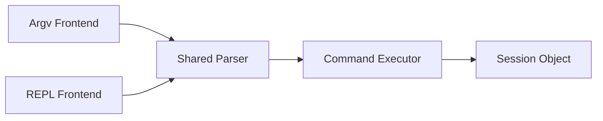
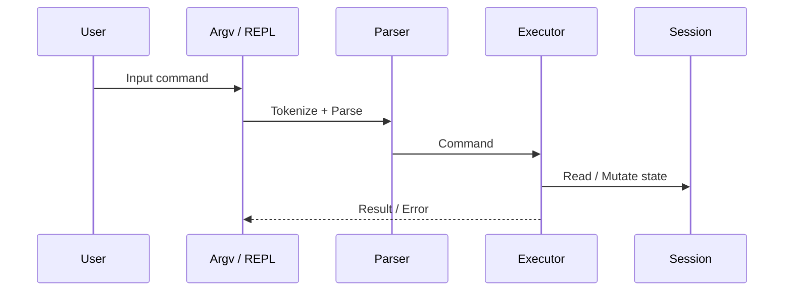
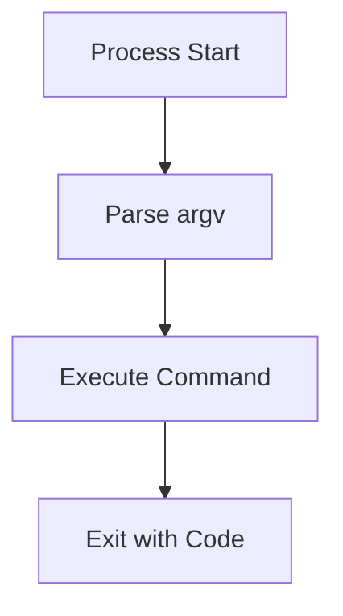
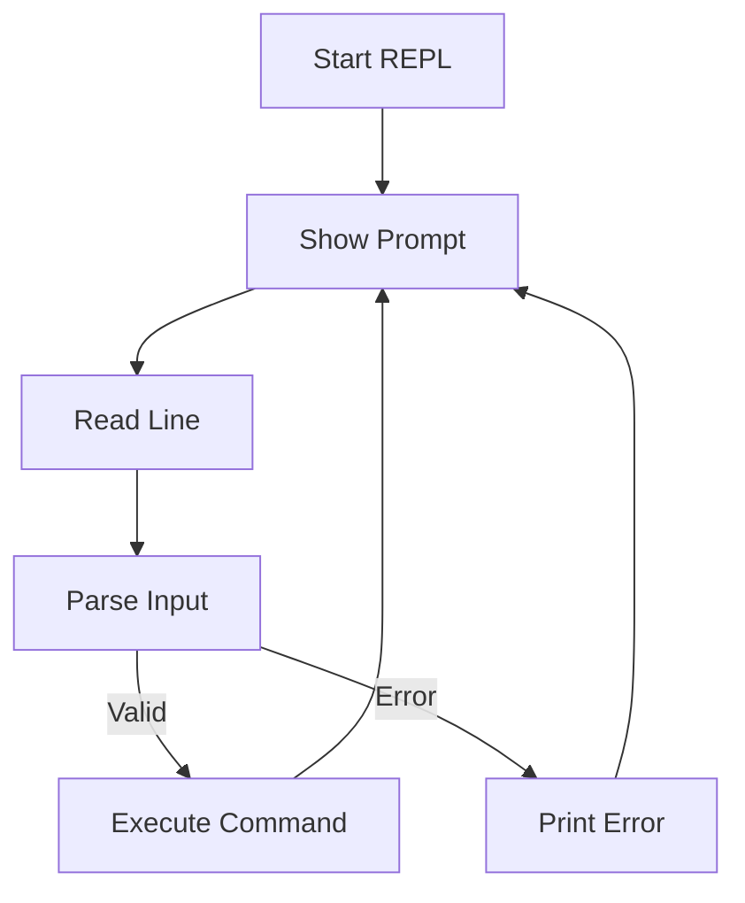

# GTAF CLI Specification

**Status:** Stable
**Last updated:** 2026-01-31
**Owner:** Core Team
**Related ADRs:** ADR-006

---

## 1. Purpose of This Document

This document provides the **concrete technical design** for the GTAF CLI architecture.
It is the implementation-level companion to **ADR-006**, which records the architectural decision and its rationale.

**Relationship between documents:**

- **ADR-0006** answers *why* this architecture was chosen
- **This document** specifies *how* it is implemented

---

## 2. Scope

This document specifies:

- Shared command parser
- Shared command executor
- Argv (non-interactive) frontend
- REPL (interactive) frontend
- Persistent session object
- Execution invariants between modes

Out of scope:

- UI/TUI rendering
- Plugin systems
- Remote execution

---

## 3. Architectural Invariants

As mandated by ADR-006, the following invariant MUST hold:

```bash
gtaf load import.db --verbose
==
REPL> load import.db --verbose
```

Any change violating this invariant is a regression.

---

## 4. High-Level Architecture



This structure directly implements the decision recorded in ADR-006.

---

## 5. Shared Parser

### Responsibilities

- Normalize all input (argv and REPL) into a token stream.
- Parse commands, arguments, options, and flags
- Validate against registered command specifications
- Produce a canonical `Command` object

Both argv and REPL produce the same internal `Command` representation.

### Command Representation

```cpp
struct Command {
    std::string name;
    std::vector<std::string> positionals;
    std::unordered_map<std::string, std::string> options;
    std::unordered_set<std::string> flags;
};
```

### Specification Notes

- Parsing is **frontend-agnostic**
- No execution logic is permitted in the parser
- Errors are reported structurally

---

## 6. Command Executor

### Responsibilities

- Dispatch commands to handlers
- Handler invocation
- Enforce execution rules
- Apply session mutations
- Produce results and exit codes

Executor behavior is frontend-agnostic.

### Handler Contract

```cpp
using CommandHandler =
    std::function<Result(const Command&, Session&)>;
```

### Design Notes

- Command handlers MUST NOT read from stdin
- Command handlers MUST NOT assume interactive context
- All state access occurs via `Session`

---

## 7. Session Object

### Purpose

The session encapsulates all long-lived CLI state and resources.
The session persists across commands in REPL mode and is initialized once in argv mode.

### Responsibilities

- Runtime configuration (verbosity, output format)
- Persistent resources (database connections, caches)
- Contextual state (current project, environment)
- REPL continuity

### Example

```cpp
struct Session {
    bool verbose = false;
    OutputFormat output = OutputFormat::Human;
    DatabaseConnection db;
};
```

---

## 8. Frontends

Both frontends rely exclusively on the shared parser and executor, as mandated by ADR-006.



### 8.1 Argv Frontend

- Reads `argc/argv`
- Converts arguments into tokens
- Executes exactly one command
- Exits with POSIX-compatible status



### 8.2 REPL Frontend

- Runs a read–eval–print loop
- Displays a contextual prompt
- Executes multiple commands in a shared session
- Never contains business logic



---

## 9. Error Handling

| Context | Behavior |
| ------- | -------- |
| Parser | Structured syntax error |
| Executor | Domain error |
| REPL | Print error, continue |
| Argv | Print error, exit non-zero |

---

## 10. Testing Requirements

### Required Invariant Test

```bash
argv(load import.db --verbose)
==
repl("load import.db --verbose")
```

### Test Levels

- Unit tests: parser, executor, handlers
- Integration tests: argv vs REPL equivalence

---

## 11. Directory Layout

```bash
cli/
 ├ frontends/
 │   ├ argv.cpp
 │   └ repl.cpp
 ├ parser/
 ├ executor/
 ├ session/
 └ commands/
```

---

## 12. Summary

This specification document:

- Implements **ADR-006**
- Specifies a single execution pipeline
- Guarantees identical behavior across interactive and non-interactive modes
- Provides a scalable foundation for future CLI evolution
